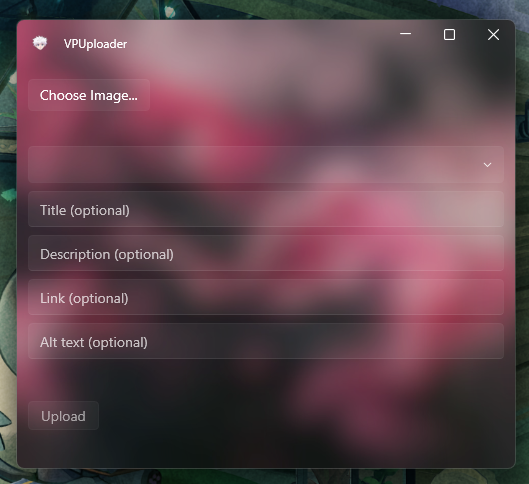

# VPUploader

A Windows desktop app for uploading images to Pinterest via the Pinterest API v5, with a right-click "Upload to Pinterest" shell integration planned. Built in C# / WPF, with a fully unit-tested core that has zero network, filesystem, or browser dependencies.



## Features

- Pick an image and upload it directly to a Pinterest board
- Fill in optional pin fields (title, description, link, alt text) — only the ones you actually use
- Board list loaded live from your Pinterest account
- OAuth 2.0 login (one-time browser authorization, silent token refresh after that)
- Fluent/Acrylic dark-themed UI (via [WPF-UI](https://github.com/lepoco/wpfui))

## Planned / not yet implemented

- Right-click "Upload to Pinterest" context-menu entry for image files in Windows Explorer
- Pinterest app registered for Standard API access (currently Trial — uploaded pins are only visible to the authenticated account until that's approved)

## Architecture

The solution is split into three projects:

- **`VPUploader.Core`** — the actual logic: OAuth flow and token refresh (`AuthService`), the Pinterest API client (`PinterestClient`), and the data models. Depends only on interfaces (`ITokenProvider`, `ITokenStore`) for its auth and storage needs, and takes an injectable `HttpClient`, rather than depending on concrete implementations directly.
- **`VPUploader.Core.Tests`** — an xUnit test suite covering both classes above, using a fake HTTP handler, an in-memory token store, and a fake token provider. No test ever touches the real network, disk, or a browser.
- **`VPUploader.App`** — the WPF front end (MVVM: `MainViewModel` + `MainWindow`), which wires the real implementations together.

This split was a deliberate choice to make the OAuth/API logic verifiable without needing live Pinterest credentials for every test run — useful both for development and for recording the demo required for Pinterest's API access review.

## Getting started

**Prerequisites:** [.NET 8 SDK](https://dotnet.microsoft.com/download/dotnet/8.0)

1. Clone the repo
2. Register your own app on the [Pinterest Developer portal](https://developers.pinterest.com/) and add `http://127.0.0.1:8756/callback/` as a redirect URI
3. Create `VPUploader.App/appsettings.local.json` with your own credentials:
   ```json
   {
     "Pinterest": {
       "ClientId": "YOUR_APP_ID",
       "ClientSecret": "YOUR_APP_SECRET"
     }
   }
   ```
4. Build and run:
   ```
   dotnet build
   dotnet run --project VPUploader.App
   ```

To run the test suite instead:
```
dotnet test
```

## Tech stack

C# · .NET 8 · WPF · [WPF-UI](https://github.com/lepoco/wpfui) · xUnit · Pinterest API v5

## Acknowledgments

Built with architectural guidance and code review from Claude (Anthropic).

## License

MIT
